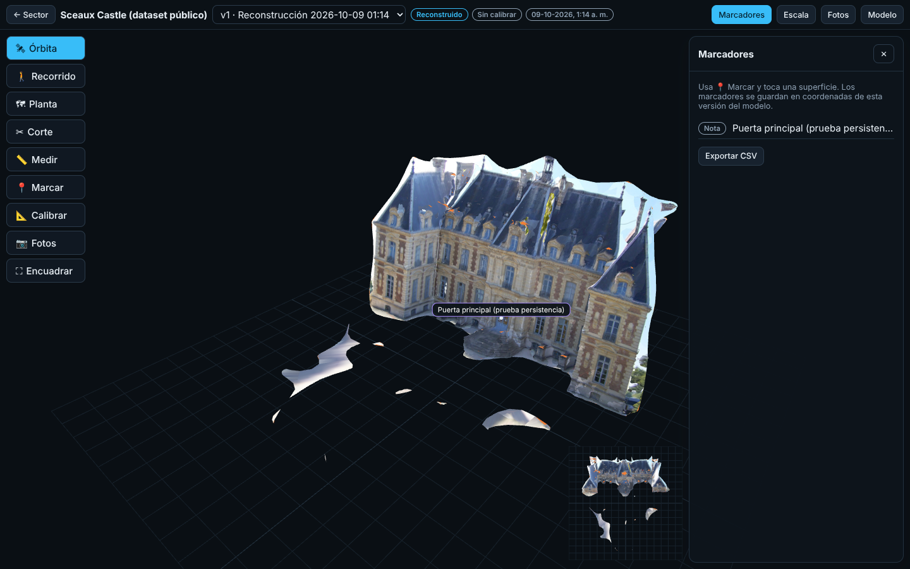

# Planta 3D

Aplicación web para **reconstruir en 3D sectores industriales a partir de fotos de celular** y documentarlos:
recorrer el modelo, ver cada foto desde donde se tomó, poner marcadores con fichas de equipos y documentos,
calibrar la escala con medidas de terreno y comprobar su exactitud con medidas reservadas.

Todo corre en tus propios equipos (sin servicios externos): las fotos y los modelos no salen de tu red.

> Estado: los hitos 0, 1 y 2 están implementados y probados de extremo a extremo con fotos reales de un
> dataset público. El hito 3 (calibración, validación, versiones) está implementado y probado con un
> **ensayo controlado sintético**. **Falta el ensayo de terreno con fotos y medidas reales de tu planta**:
> ver [docs/REPORTE_PRUEBAS.md](docs/REPORTE_PRUEBAS.md).



## Qué hace

| Paso | En la app |
|---|---|
| Capturar | Guía de captura en pantalla. Desde el teléfono: «Tomar fotos». Cada foto se revisa al instante en el dispositivo (formato real, posible desenfoque, exposición) antes de subir. |
| Subir | Carga por lotes con progreso, reintentos por archivo y cancelación. El servidor valida el formato real, detecta duplicados (SHA-256) e ilegibles, orienta una sola vez según EXIF, conserva el original inmutable y no guarda GPS. |
| Revisar | Diagnóstico del lote: fotos aceptadas/rechazadas/duplicadas, indicadores de nitidez y exposición, grupos de cámara y supuestos de focal. Excluir o incluir fotos siempre deja registro y motivo. |
| Reconstruir | Trabajo en cola con 11 etapas visibles (COLMAP 4.2.1 para cámaras y puntos; OpenMVS 2.4.0 para profundidad, malla y textura). Tiempo y memoria por etapa, registro de eventos, cancelación real. Sin porcentajes inventados. |
| Verificar | Informe: fotos registradas, componentes desconectados, error de reproyección, triángulos, tamaño, área sin imagen asignada y **verificación automática de la textura contra las fotos**. |
| Inspeccionar | Visor 3D: órbita, recorrido en primera persona (teclado o joystick táctil), vista de planta ortográfica, corte horizontal, minimapa, encuadre y **«ver desde la foto»** (la foto original se superpone alineada sobre el modelo). |
| Documentar | Marcadores en coordenadas del modelo, fichas de equipos (TAG manual, estado operacional solo con fecha y origen), enlaces, PDF y fotos de referencia. |
| Medir | Calibración con una o más referencias de terreno; comprobaciones reservadas con error absoluto y relativo; tolerancia según el uso. Estados: sin calibrar → calibrado sin verificar → verificado. Sin calibración no se muestran metros. |
| Exportar | GLB orientado o en metros (la transformación va en el archivo), marcadores CSV, captura de pantalla. |
| Planta | Plano esquemático con todos los sectores del proyecto (no mezcla sistemas de coordenadas: cada sector es independiente). |

## Comparación honesta con Matterport

| | Planta 3D | Matterport |
|---|---|---|
| Datos | En tus servidores; formatos abiertos (GLB, PLY, JSON) | En la nube del proveedor |
| Equipo de captura | Cualquier teléfono con cámara (sin LiDAR) | Cámaras propias, 360 o teléfonos compatibles |
| Trazabilidad | Original inmutable + hash, parámetros, comandos, tiempos y versiones por etapa | Limitada al usuario |
| Mediciones | Escala calibrada con medidas propias y **verificación con medidas reservadas** | Escala del sensor, sin verificación propia |
| Velocidad | Minutos a horas según fotos y hardware (CPU probado; GPU opcional) | Procesamiento en nube, rápido |
| Captura | Exige técnica fotogramétrica (desplazarse, superposición) | Más tolerante: escaneo por puntos |
| Pulido | Primera versión | Producto maduro (planos automáticos, tours, integraciones) |

En resumen: es mejor en **control de datos, trazabilidad y validación dimensional**; Matterport sigue siendo
más rápido y tolerante para capturar y procesar. Ver límites en [docs/REPORTE_PRUEBAS.md](docs/REPORTE_PRUEBAS.md).

## Inicio rápido

### Opción A: Docker (recomendado para usar la app)

```bash
cd planta3d/deploy
cp .env.example .env            # completa contraseñas y P3D_SECRET_KEY (p. ej. `openssl rand -hex 32`)
docker compose --profile cpu up -d --build    # base de datos, cola, API/web y trabajador de reconstrucción
# Abre http://127.0.0.1:8000 e ingresa con P3D_BOOTSTRAP_ADMIN_EMAIL / P3D_BOOTSTRAP_ADMIN_PASSWORD
docker compose --profile cpu down              # detener (los datos quedan en volúmenes)
```

Sin `--profile cpu` se levanta el perfil básico (visor e importación de GLB, sin reconstrucción). El perfil
`--profile gpu` compila OpenMVS con CUDA para equipos NVIDIA; **no fue probado** (ver reporte).
Detrás de un proxy corporativo con inspección TLS, copia el certificado raíz a `deploy/certs/`.

### Opción B: desarrollo local sin Docker (Linux o WSL2)

Ver [docs/INSTALACION.md](docs/INSTALACION.md). Resumen:

```bash
sudo bash planta3d/scripts/build_openmvs.sh      # compila OpenMVS 2.4.0 en /opt/openmvs (≈20 min, una vez)
cd planta3d/backend && uv venv .venv && uv pip sync --python .venv/bin/python requirements.lock
cp .env.example .env                             # define P3D_BOOTSTRAP_ADMIN_PASSWORD
cd ../frontend && npm ci && npm run build
cd .. && scripts/dev_local.sh up                 # PostgreSQL, Redis, migraciones, API y trabajador en 127.0.0.1
```

Para desarrollar la interfaz con recarga en vivo: `cd frontend && npm run dev` (http://127.0.0.1:5173).

## Uso en 6 pasos

1. **Proyecto → Nuevo sector** (p. ej. «Skid de bombeo agua tratada»).
2. **Captura**: lee la guía, toma o sube las fotos (JPEG/PNG originales). Revisa el diagnóstico.
3. **Reconstrucción**: elige perfil (Rápido para validar la captura; Estándar; Detalle) e inicia.
4. **Modelos y visor**: abre el modelo; usa «Fotos» para comprobar que coincide con lo fotografiado.
5. **Escala**: con 📐 toca los extremos de una distancia medida en terreno («referencia») y luego al menos
   tres más («comprobaciones reservadas»); registra la tolerancia según el uso.
6. **Marcar**: con 📍 agrega equipos, vincula fichas y documentos; exporta lo que necesites.

Guía de captura completa: [docs/CAPTURA.md](docs/CAPTURA.md).

## Documentación

| Documento | Contenido |
|---|---|
| [docs/CAPTURA.md](docs/CAPTURA.md) | Cómo fotografiar un sector para reconstruirlo y medirlo |
| [docs/INSTALACION.md](docs/INSTALACION.md) | Instalación local y con Docker; requisitos de hardware |
| [docs/OPERACION.md](docs/OPERACION.md) | Iniciar/detener, reconstruir, exportar, respaldar y restaurar |
| [docs/ARQUITECTURA.md](docs/ARQUITECTURA.md) | Componentes, etapas, convenciones de coordenadas, seguridad |
| [docs/HITO0.md](docs/HITO0.md) | Prueba técnica del motor con fotos reales |
| [docs/REPORTE_PRUEBAS.md](docs/REPORTE_PRUEBAS.md) | Pruebas de aceptación: ejecutadas, resultados y pendientes |
| [docs/LICENCIAS.md](docs/LICENCIAS.md) | Inventario de licencias y dependencias |
| API | OpenAPI en `http://127.0.0.1:8000/docs`; ejemplo funcional en `scripts/e2e_api.py` |

## Estructura

```
planta3d/
  backend/      API FastAPI, modelos SQLAlchemy, migraciones Alembic, motor (pipeline), trabajador Celery, pruebas
  frontend/     React + TypeScript + Vite + Three.js
  deploy/       Dockerfiles, docker-compose (perfiles básico/cpu/gpu), parche de compatibilidad de OpenMVS
  scripts/      arranque local, compilación de OpenMVS, respaldo, pruebas E2E/UI y ensayo de escala
  docs/         guías, reporte de pruebas, evidencias y capturas
```
